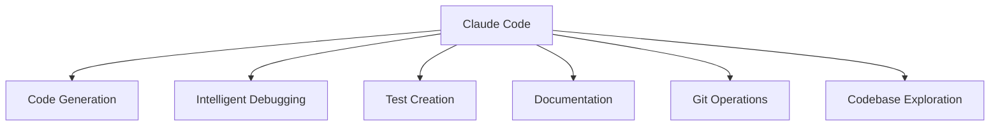
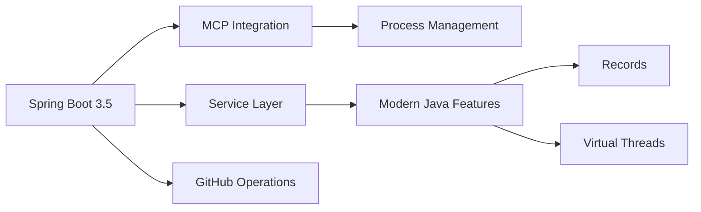

# Claude Code Training Course
## Agentic Coding with AI

**Ken Kousen**  
*Author • Speaker • Developer*

<div class="pt-12">
  <span @click="$slidev.nav.next" class="px-2 py-1 rounded cursor-pointer" hover="bg-white bg-opacity-10">
    Learn to leverage Claude Code for professional development workflows <carbon:arrow-right class="inline"/>
  </span>
</div>

<div class="abs-br m-6 flex gap-2">
  <button @click="$slidev.nav.openInEditor()" title="Open in Editor" class="text-xl slidev-icon-btn opacity-50 !border-none !hover:text-white">
    <carbon:edit />
  </button>
  <a href="https://github.com/kousen" target="_blank" alt="GitHub" title="Open in GitHub"
    class="text-xl slidev-icon-btn opacity-50 !border-none !hover:text-white">
    <carbon-logo-github></carbon-logo-github>
  </a>
</div>

---
layout: two-cols
layoutClass: gap-16
---

# Course Overview

## What You'll Learn
- Master Claude Code fundamentals
- Navigate and understand codebases
- Implement effective testing strategies
- Streamline Git operations
- Create professional documentation
- Debug complex issues efficiently

## Course Structure
- **5 hours** of core content
- **Hands-on exercises** throughout
- **Real-world examples** from production code
- **Best practices** from industry use

::right::

<div class="text-center mt-8">
  
</div>

<v-clicks>

- ✅ **Based on real experience**
- ✅ **Production Java/Spring projects**
- ✅ **Anthropic team insights**
- ✅ **Practical workflows**

</v-clicks>

<style>
h1 {
  background-color: #2B90B6;
  background-image: linear-gradient(45deg, #4EC5D4 10%, #146b8c 20%);
  background-size: 100%;
  -webkit-background-clip: text;
  -moz-background-clip: text;
  -webkit-text-fill-color: transparent;
  -moz-text-fill-color: transparent;
}
</style>

---
layout: default
---

# What is Claude Code?

<div class="grid grid-cols-2 gap-8 mt-8">

<div>

## Agentic Coding Assistant

<v-clicks>

- **Command-line AI tool** that works directly in your development environment
- **Context-aware** - understands your entire codebase
- **Autonomous capabilities** - can work independently or collaboratively
- **Multi-language support** - Java, Python, JavaScript, and more

</v-clicks>

</div>

<div>

<v-click>

### Key Capabilities


</v-click>

</div>

</div>

<v-click>

### Perfect For
Spring Boot applications • Complex enterprise codebases • API development • Microservices architectures • Testing workflows

</v-click>

---
layout: default
---

# Installation & Setup

## Installation Methods

```bash {all|1-2|4-5|all}
# Install via npm
npm install -g @anthropic-ai/claude

# Or download from GitHub releases
# https://github.com/anthropic-ai/claude/releases
```

<div class="grid grid-cols-2 gap-8 mt-8">

<div>

## Authentication Setup

```bash {1-2|4-5}
# Set your API key
export ANTHROPIC_API_KEY="your-api-key-here"

# Or configure interactively
claude auth login
```

</div>

<div>

## Verify Installation

```bash
claude --version
claude --help
```

</div>

</div>

<div class="mt-8 p-4 bg-yellow-100 rounded-lg border-l-4 border-yellow-500">
  <strong>💡 Pro Tip:</strong> Add your API key to your shell profile (.bashrc, .zshrc) for persistent access
</div>

---
layout: default
---

# Basic Command Structure

## Core Commands

```bash {1-2|4-5|7-8|all}
# Navigate to your project
cd /path/to/your/spring-boot-project

# Start Claude Code
claude

# Or start with specific instructions
claude "Help me understand this Spring application"
```

<div class="grid grid-cols-2 gap-8 mt-8">

<div>

## Command Syntax

<v-clicks>

- **Natural language prompts** - Describe what you want to accomplish
- **File-specific requests** - Reference files directly  
- **Multi-step workflows** - Chain complex operations

</v-clicks>

</div>

<div>

<v-click>

<div class="text-center p-6 bg-blue-50 rounded-lg border-2 border-dashed border-blue-300">
  <h3 class="text-lg font-bold text-blue-800">🚀 Demo Time!</h3>
  <p class="text-blue-600">Let's see Claude Code in action with a Spring Boot project</p>
</div>

</v-click>

</div>

</div>

---
layout: two-cols
layoutClass: gap-16
---

# Understanding the Interface

## Command Mode
<v-clicks>

- Interactive chat interface
- Context-aware responses
- File system access
- Git integration

</v-clicks>

## Auto-Accept Mode
<v-clicks>

- Press `Shift+Tab`
- Autonomous execution
- Minimal supervision
- Great for prototyping

</v-clicks>

::right::

## Key Features

<v-clicks>

- **Project memory** - Remembers context
- **File awareness** - Knows your codebase
- **Smart suggestions** - Contextual recommendations
- **Error handling** - Explains and fixes issues

</v-clicks>

<div class="mt-8 p-4 bg-green-100 rounded-lg border-l-4 border-green-500">
  <strong>📝 From Anthropic teams:</strong> "Claude Code becomes a primary tool, open 80% of the time alongside your IDE"
</div>

---
layout: default
---

# Code Search & Understanding

## Codebase Navigation

<div class="grid grid-cols-2 gap-8">

<div>

<v-clicks>

- **Intelligent search** - Find files, functions, patterns
- **Architecture overview** - Understand system structure
- **Dependency mapping** - Trace relationships
- **Pattern recognition** - Identify common frameworks

</v-clicks>

</div>

<div>

<v-click>

### Real-World Example: Spring AI Project

```bash
# Example commands:
"Show me the main application structure"
"Find all REST controllers in this project"
"Explain the Spring AI configuration"
"Trace the flow from controller to service layer"
```

</v-click>

</div>

</div>

<div class="mt-8 p-4 bg-blue-100 rounded-lg border-l-4 border-blue-500">
  <strong>🔍 Anthropic Insight:</strong> Data Infrastructure team replaces traditional data catalogs with Claude Code for codebase discovery
</div>

---
layout: default
---

# High-Level Project Analysis

<div class="grid grid-cols-2 gap-8">

<div>

## Spring Boot Projects

<v-clicks>

- Configuration classes
- Service layer design
- Data access patterns
- Security implementation

</v-clicks>

</div>

<div>

## Claude Code Analysis

<v-clicks>

- Framework detection
- Design pattern identification
- Best practice validation
- Improvement suggestions

</v-clicks>

</div>

</div>

<v-click>

<div class="mt-2">

### Example: MCP Server Analysis
<p class="text-sm">From the GitHub MCP Server project:</p>

<div style="transform: scale(0.75); transform-origin: top center; margin-top: -20px;">



</div>

</div>

</v-click>

---
layout: two-cols
layoutClass: gap-16
---

# File Editing & Refactoring

## Editing Capabilities

<v-clicks>

- **Multi-file operations** - Change multiple files simultaneously
- **Smart refactoring** - Maintain code consistency
- **Pattern replacement** - Apply changes across codebase
- **Modern syntax adoption** - Upgrade to newer language features

</v-clicks>

::right::

<div class="grid grid-cols-1 gap-4">

<div>

### Java Modernization

<v-clicks>

- Convert to Records
- Add Virtual Threads
- Switch expressions
- Pattern matching

</v-clicks>

</div>

<div>

### Spring Updates

<v-clicks>

- Configuration properties
- Dependency injection patterns
- Test modernization
- Security improvements

</v-clicks>

</div>

</div>

<div class="mt-8 text-center p-4 bg-purple-50 rounded-lg border-2 border-dashed border-purple-300">
  <h3 class="text-lg font-bold text-purple-800">🔄 Live Demo</h3>
  <p class="text-purple-600">Refactoring a Spring service to use modern Java features</p>
</div>

---
layout: default
---

# Bug Fixing Strategies

## Systematic Debugging Approach

<v-clicks>

- **Error analysis** - Understand stack traces and exceptions
- **Root cause identification** - Trace issues to source
- **Fix implementation** - Apply targeted solutions
- **Verification** - Ensure fixes work correctly

</v-clicks>

<v-click>

## Real Examples from Security Engineering

<div class="mt-6 p-6 bg-gradient-to-r from-red-50 to-orange-50 rounded-lg border-l-4 border-red-500">

**Infrastructure Debugging:**
- ⚡ Reduced debugging time from **10-15 minutes to 5 minutes**
- 📊 Stack trace analysis with documentation context
- 🔍 Control flow tracing through complex codebases

</div>

</v-click>

<div class="mt-6 p-4 bg-yellow-100 rounded-lg border-l-4 border-yellow-500">
  <strong>💡 Pro Tip:</strong> Use Claude Code to explain error messages in plain English before attempting fixes
</div>

---
layout: default
---

# Testing & Quality Assurance

<div class="grid grid-cols-2 gap-8">

<div>

## Test Generation

<v-clicks>

- **Unit test creation** - Comprehensive test coverage
- **Edge case identification** - Find scenarios you missed
- **Integration tests** - End-to-end validation
- **Mock object setup** - Proper test isolation

</v-clicks>

</div>

<div>

<v-click>

### Example: Spring AI Training Course Tests

```bash
# Generate tests for service layer
"Create unit tests for the FilmographyService class"

# Test Spring AI integration
"Write integration tests for the ChatClient configuration"

# Test edge cases
"Add tests for error scenarios in the AI service"
```

</v-click>

</div>

</div>

<div class="mt-8 p-4 bg-green-100 rounded-lg border-l-4 border-green-500">
  <strong>🎯 Anthropic Teams:</strong> "Claude automatically includes missed edge cases, completing what would normally take significant mental energy in minutes"
</div>

---
layout: two-cols
layoutClass: gap-16
---

# Test-Driven Development

## Traditional TDD

<v-clicks>

1. Write failing test
2. Write minimal code  
3. Refactor
4. Repeat

</v-clicks>

## Claude Code TDD

<v-clicks>

1. Describe requirements
2. Generate comprehensive tests
3. Implement solution
4. Refactor and optimize

</v-clicks>

::right::

<v-click>

## Security Team's Transformation

<div class="space-y-4">

<div class="p-4 bg-red-50 rounded-lg border-l-4 border-red-400">
  <strong>Before:</strong> "design doc → janky code → refactor → give up on tests"
</div>

<div class="p-4 bg-green-50 rounded-lg border-l-4 border-green-400">
  <strong>After:</strong> "Ask Claude for pseudocode → guide through TDD → periodic check-ins → reliable, testable code"
</div>

</div>

</v-click>

<div class="mt-6 p-4 bg-blue-100 rounded-lg border-l-4 border-blue-500">
  <strong>⭐ Best Practice:</strong> Ask Claude to generate tests before writing code for better autonomous operation
</div>

---
layout: default
---

# Git Operations

## Git Integration Features

<div class="grid grid-cols-2 gap-8">

<div>

<v-clicks>

- **Commit message generation** - Meaningful, conventional commits
- **Branch management** - Create and manage feature branches
- **Merge conflict resolution** - Intelligent conflict solving
- **Pull request creation** - Automated PR generation

</v-clicks>

</div>

<div>

<v-click>

### Example Workflow

```bash
# Commit with generated message
"Commit these changes with an appropriate message"

# Create feature branch
"Create a new branch for the AI service refactoring"

# Resolve conflicts
"Help me resolve the merge conflicts in the service layer"

# Generate PR description
"Create a pull request for this feature"
```

</v-click>

</div>

</div>

<div class="mt-8 p-4 bg-purple-100 rounded-lg border-l-4 border-purple-500">
  <strong>🤖 Product Team Example:</strong> GitHub Actions integration automatically addresses PR comments like formatting issues or function renaming
</div>

---
layout: default
---

# Code Base Exploration

## Techniques for Understanding New Projects

<div class="grid grid-cols-2 gap-8">

<div>

<v-clicks>

- **Component identification**  
  Find key architectural elements
- **Execution flow tracing**  
  Follow request/response paths
- **Pattern recognition**  
  Identify frameworks and conventions
- **Dependency analysis**  
  Understand module relationships

</v-clicks>

</div>

<div>

<v-click>

### Example Commands

```bash
"Give me an overview of this Spring Boot application"

"Show me the data flow from REST endpoints to database"

"Identify all the configuration files and their purposes"

"Find examples of how authentication is implemented"
```

</v-click>

</div>

</div>

---
layout: default
---

# Onboarding Acceleration

<div class="mt-8 p-6 bg-gradient-to-r from-blue-50 to-indigo-50 rounded-lg border-l-4 border-blue-500">

**From Inference Team:**
- 📚 Codebase comprehension in **seconds** instead of asking colleagues
- 🏗️ Find relevant files and understand architecture quickly
- ⚡ Reduce onboarding time from **weeks to days**

</div>

<div class="mt-8 text-center">
<v-clicks>

- New team members become productive faster
- Less interruption for senior developers
- Self-service learning through AI assistance

</v-clicks>
</div>

---
layout: default
---

# Documentation Generation

<div class="grid grid-cols-2 gap-8">

<div>

## Documentation Types

<v-clicks>

- **Inline comments** - Code-level documentation
- **README files** - Project overviews and setup guides
- **API documentation** - Service and endpoint descriptions
- **Architecture docs** - System design explanations

</v-clicks>

</div>

<div>

### Real Example: MCP Server README

<v-click>

**Your GitHub MCP Server README demonstrates excellent documentation:**

</v-click>

<v-clicks at="2">

- ✅ Clear installation instructions
- ✅ Configuration examples
- ✅ Feature descriptions with examples
- ✅ Troubleshooting guidance
- ✅ Technology stack explanation

</v-clicks>

</div>

</div>

<div class="mt-8 p-4 bg-indigo-100 rounded-lg border-l-4 border-indigo-500">
  <strong>📝 Claude.md Files:</strong> Create detailed workflow documentation to guide Claude Code's behavior in your projects
</div>

---
layout: default
---

# Debugging Workflows

<div class="grid grid-cols-2 gap-8">

<div>

## Debugging Capabilities

<v-clicks>

- **Error message analysis** - Explain complex exceptions
- **Stack trace navigation** - Follow execution paths
- **Configuration debugging** - Spring Boot property issues
- **Integration debugging** - Service communication problems

</v-clicks>

</div>

<div>

<v-click>

### Example: Spring AI Debugging

```bash
# Common debugging scenarios:
"Explain this Spring AI configuration error"

"Why is my ChatClient not autowiring correctly?"

"Debug this API key authentication issue"

"Trace the execution flow for this failing test"
```

</v-click>

</div>

</div>

<div class="mt-8 p-4 bg-orange-100 rounded-lg border-l-4 border-orange-500">
  <strong>🛠️ Data Infrastructure Team:</strong> Used screenshots of dashboards to diagnose Kubernetes cluster issues, with Claude providing exact commands to fix pod IP address exhaustion
</div>

---
layout: default
---

# Advanced Features

<div class="grid grid-cols-2 gap-8">

<div>

## Extended Thinking Mode

<v-clicks>

- **Complex problem solving** - Multi-step reasoning
- **Architecture decisions** - Design pattern selection
- **Performance optimization** - Code improvement strategies

</v-clicks>

</div>

<div>

<v-click>

### Project Memory Setup

```bash
# Create Claude.md in your project root
echo "# Project Guidelines
- Use Spring Boot 3.x conventions
- Follow Java 21 patterns
- Prefer records over classes
- Use virtual threads for I/O
- Write comprehensive tests" > Claude.md
```

</v-click>

</div>

</div>

<v-click>

## Custom Slash Commands

<div class="mt-6 p-6 bg-gradient-to-r from-purple-50 to-pink-50 rounded-lg border-l-4 border-purple-500">

**🔧 Security Engineering:** Uses **50%** of all custom slash command implementations across the monorepo for streamlined workflows

</div>

</v-click>

---
layout: two-cols
layoutClass: gap-16
---

# Model Context Protocol (MCP)

## What is MCP?

<v-clicks>

- **Standard protocol** - Connect AI to external systems
- **Tool integration** - Access APIs, databases, services
- **Context enhancement** - Provide relevant data to AI
- **Security controls** - Manage access and permissions

</v-clicks>

::right::

## Your MCP Server Examples

<div class="space-y-4">

<v-click>

### GitHub MCP Server
- Repository operations
- Issue management
- Pull request handling
- File content access

</v-click>

<v-click>

### Osquery MCP Server
- System diagnostics
- Process monitoring
- Network analysis
- Security insights

</v-click>

</div>

<div class="mt-6 p-4 bg-red-100 rounded-lg border-l-4 border-red-500">
  <strong>🔒 Security Note:</strong> Use MCP servers instead of CLI for sensitive data to maintain better security control
</div>

---
layout: center
class: text-center
---

# Hands-On Exercise Overview

<div class="grid grid-cols-2 gap-12 mt-8">

<div>

## Refactoring Legacy Code

<v-clicks>

- Modernize Java syntax
- Update Spring configurations
- Improve error handling
- Add comprehensive tests

</v-clicks>

</div>

<div>

## Documentation Creation

<v-clicks>

- Generate README files
- Create API documentation
- Add inline comments
- Write setup guides

</v-clicks>

</div>

</div>

<v-click>

<div class="mt-12 p-6 bg-gradient-to-r from-blue-50 to-purple-50 rounded-lg border-2 border-dashed border-blue-300">
  <h3 class="text-xl font-bold text-blue-800">🚀 Coming Up: Live Exercises</h3>
  <p class="text-blue-600 mt-2">We'll work through real examples from Spring AI and MCP projects</p>
</div>

</v-click>

---
layout: default
---

# Exercise 1: Legacy Code Refactoring

## Scenario
You have a Spring Boot service using older Java patterns. Use Claude Code to modernize it.

<div class="grid grid-cols-2 gap-8 mt-6">

<div>

## Tasks

<v-clicks>

1. **Convert classes to records** where appropriate
2. **Add virtual thread support** for I/O operations
3. **Update to modern Spring patterns**
4. **Add comprehensive error handling**
5. **Generate missing tests**

</v-clicks>

</div>

<div>

<v-click>

### Example Starting Point

```java
public class UserService {
    private final UserRepository repository;
    
    public UserService(UserRepository repository) {
        this.repository = repository;
    }
    
    public User findUser(String id) {
        return repository.findById(id).orElse(null);
    }
}
```

</v-click>

</div>

</div>

<div class="mt-6 flex justify-center">
  <div class="px-6 py-3 bg-blue-500 text-white rounded-lg font-semibold">
    ⏱️ Time: 15 minutes | 🎯 Goal: Modernize the service class completely
  </div>
</div>

---
layout: default
---

# Exercise 2: Documentation Generation

## Scenario
Create comprehensive documentation for an undocumented Spring AI integration.

<div class="grid grid-cols-2 gap-8 mt-6">

<div>

## Tasks

<v-clicks>

1. **Generate README.md** with setup instructions
2. **Create API documentation** for REST endpoints
3. **Add inline comments** to complex methods
4. **Write configuration guide** for environment variables

</v-clicks>

</div>

<div>

### Follow This Pattern

<v-click>

**From your GitHub MCP Server documentation:**

</v-click>

<v-clicks at="2">

- Clear overview and features
- Step-by-step setup guide
- Configuration examples
- Usage examples with code
- Troubleshooting section

</v-clicks>

</div>

</div>

<div class="mt-6 flex justify-center">
  <div class="px-6 py-3 bg-green-500 text-white rounded-lg font-semibold">
    ⏱️ Time: 15 minutes | 🎯 Goal: Professional-quality documentation
  </div>
</div>

---
layout: two-cols
layoutClass: gap-16
---

# Best Practices

## Effective Prompt Crafting

<v-clicks>

- **Be specific** - Clear, detailed instructions work better
- **Provide context** - Explain your goals and constraints
- **Iterate gradually** - Make incremental improvements
- **Use examples** - Show desired patterns or styles

</v-clicks>

::right::

<div class="space-y-6">

<div>

### Development Process

<v-clicks>

- Start with clean git state
- Commit checkpoints regularly
- Review changes before accepting
- Test generated code thoroughly

</v-clicks>

</div>

<div>

### Team Collaboration

<v-clicks>

- Share Claude.md configurations
- Document successful patterns
- Review AI-generated code together
- Establish team conventions

</v-clicks>

</div>

</div>

<div class="mt-8 p-4 bg-blue-100 rounded-lg border-l-4 border-blue-500">
  <strong>🔑 Key Insight:</strong> Treat Claude Code as an iterative partner, not a one-shot solution
</div>

---
layout: two-cols
layoutClass: gap-16
---

# Maintaining Control

## Auto-Accept vs. Supervised Mode

### Auto-Accept Mode

<v-clicks>

- Peripheral features
- Prototyping
- Documentation tasks
- Test generation
- Routine refactoring

</v-clicks>

### Supervised Mode

<v-clicks>

- Core business logic
- Security-critical code
- Complex integrations
- Architecture decisions
- Performance-critical paths

</v-clicks>

::right::

<v-click>

## Checkpoint Strategy

<div class="p-6 bg-gradient-to-r from-green-50 to-blue-50 rounded-lg border-l-4 border-green-500">

**RL Engineering Approach:**
- 📝 Frequently commit checkpoints during Claude's work
- 🔄 Use "try and rollback" methodology
- 🧪 Enable experimental approach without risk

</div>

</v-click>

<div class="mt-6 p-4 bg-yellow-100 rounded-lg border-l-4 border-yellow-500">
  <strong>📊 Rule of Thumb:</strong> Claude works on first attempt about one-third of the time - plan accordingly
</div>

---
layout: default
---

# Cost Optimization Strategies

<div class="grid grid-cols-2 gap-8">

<div>

## Efficient Usage Patterns

<v-clicks>

- **Batch similar tasks** - Group related operations
- **Use precise prompts** - Avoid unnecessary iterations
- **Leverage project memory** - Reduce context repetition
- **Start simple** - Begin with minimal viable requests

</v-clicks>

</div>

<div>

<v-click>

### High-Value Tasks
✅ Complex refactoring  
✅ Test generation  
✅ Documentation creation  
✅ Bug investigation

### Consider Alternatives
❌ Simple text editing  
❌ Basic file operations  
❌ Routine formatting  
❌ Simple grep operations

</v-click>

</div>

</div>

<div class="mt-8 p-4 bg-purple-100 rounded-lg border-l-4 border-purple-500">
  <strong>💡 Growth Marketing Insight:</strong> Focus on API-enabled repetitive tasks where Claude Code provides the most value
</div>

---
layout: default
---

# Future Developments

<div class="grid grid-cols-2 gap-8">

<div>

## Emerging Capabilities

<v-clicks>

- **Enhanced MCP integration** - More tool connections
- **Improved autonomous operation** - Longer independent work
- **Better error recovery** - Self-correction capabilities
- **IDE integration** - Deeper development environment integration

</v-clicks>

</div>

<div>

<v-click>

### Industry Trends

**Technical Evolution:**
- More sophisticated reasoning
- Better code understanding
- Enhanced multi-language support
- Improved testing capabilities

**Workflow Integration:**
- CI/CD pipeline integration
- Code review automation
- Security scanning integration
- Performance optimization

</v-click>

</div>

</div>

<div class="mt-8 p-6 bg-gradient-to-r from-blue-50 to-indigo-50 rounded-lg border-l-4 border-blue-500">
  <strong>🚀 Vision:</strong> Claude Code as a fundamental part of the development lifecycle, not just a helper tool
</div>

---
layout: default
---

# Real-World Success Stories

<div class="grid grid-cols-2 gap-6">

<div>

### Product Development
<v-clicks>

- **70% code autonomy** for Vim mode implementation
- **Faster prototyping** with auto-accept mode
- **Quality maintenance** through automated testing

</v-clicks>

### Data Science
<v-clicks>

- **5,000-line TypeScript apps** built with minimal JS knowledge
- **2-4x time savings** on routine refactoring
- **Persistent tools** instead of throwaway notebooks

</v-clicks>

</div>

<div>

### Security Engineering
<v-clicks>

- **50% reduction** in incident resolution time
- **Days to weeks** improvement in project onboarding
- **Autonomous documentation** synthesis

</v-clicks>

### Growth Marketing
<v-clicks>

- **2 hours to 15 minutes** for ad copy creation
- **10x increase** in creative output
- **Team-level productivity** with single-person team

</v-clicks>

</div>

</div>

---
layout: default
---

# Your Success Framework

## Getting Started Checklist

<v-clicks>

1. **Install and configure** Claude Code in your environment
2. **Create Claude.md** files for your key projects
3. **Start with low-risk tasks** like documentation and tests
4. **Build confidence** with supervised operations
5. **Graduate to autonomous** mode for appropriate tasks

</v-clicks>

<div class="mt-8 text-sm text-gray-600">
  💡 <strong>Remember:</strong> Share prototypes and workflows with your team to multiply the impact
</div>

---
layout: default
---

# Progressive Adoption Strategy

<div class="mt-8 p-6 bg-gradient-to-r from-green-50 to-blue-50 rounded-lg">

<v-clicks>

- **Week 1:** Basic code exploration and documentation  
- **Week 2:** Test generation and simple refactoring  
- **Week 3:** Complex debugging and multi-file operations  
- **Week 4:** Autonomous development workflows

</v-clicks>

</div>

<v-click>

<div class="mt-8 p-4 bg-yellow-100 rounded-lg border-l-4 border-yellow-500">
  <strong>🚀 Pro Tip:</strong> Start with small wins to build confidence and demonstrate value to your team
</div>

</v-click>

---
layout: two-cols
layoutClass: gap-16
---

# Key Takeaways

## Transform Your Development Process

<v-clicks>

- **Code understanding** - Navigate complex codebases effortlessly
- **Quality assurance** - Generate comprehensive tests automatically
- **Documentation** - Create professional docs in minutes
- **Debugging** - Resolve issues faster with AI assistance
- **Modernization** - Refactor legacy code to modern patterns

</v-clicks>

::right::

<div class="space-y-6">

<div>

### Technical Excellence

<v-clicks>

- Precise, detailed prompts
- Iterative collaboration
- Checkpoint-driven development
- Context-aware workflows

</v-clicks>

</div>

<div>

### Strategic Integration

<v-clicks>

- Team knowledge sharing
- Progressive complexity adoption
- Cost-conscious usage
- Continuous improvement

</v-clicks>

</div>

</div>

<div class="mt-8 p-6 bg-gradient-to-r from-purple-50 to-pink-50 rounded-lg border-l-4 border-purple-500 text-center">
  <strong class="text-lg">🚀 Claude Code isn't just a tool - it's a development force multiplier</strong>
</div>

---
layout: end
class: text-center
---

# Thank You!

## Questions & Discussion

<div class="mt-12 space-y-4">

**📚 Documentation:** [docs.anthropic.com](https://docs.anthropic.com/en/docs/claude-code/overview)

**📧 Ken Kousen:** ken.kousen@kousenit.com

**🎓 Training Resources:** kousenit.com

</div>

<div class="mt-16 text-lg italic text-gray-600">
  Continue your Claude Code journey<br>
  Build amazing things with AI assistance
</div>

<div class="abs-br m-6 flex gap-2">
  <a href="https://twitter.com/kenkousen" target="_blank" alt="Twitter"
    class="text-xl slidev-icon-btn opacity-50 !border-none !hover:text-white">
    <carbon-logo-twitter />
  </a>
  <a href="https://github.com/kousen" target="_blank" alt="GitHub"
    class="text-xl slidev-icon-btn opacity-50 !border-none !hover:text-white">
    <carbon-logo-github />
  </a>
</div>
