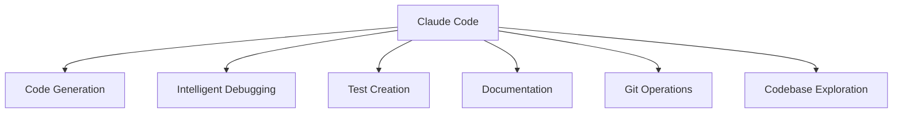
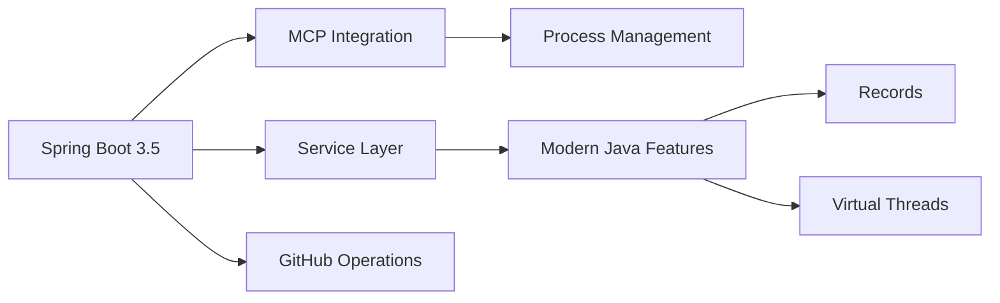

# Claude Code Training Course
## Agentic Coding with AI

**Ken Kousen**  
*Author • Speaker • Developer*

<div class="pt-12">
  <span @click="$slidev.nav.next" class="px-2 py-1 rounded cursor-pointer" hover="bg-white bg-opacity-10">
    Learn to leverage Claude Code for professional development workflows <carbon:arrow-right class="inline"/>
  </span>
</div>

<div class="abs-br m-6 flex gap-2">
  <button @click="$slidev.nav.openInEditor()" title="Open in Editor" class="text-xl slidev-icon-btn opacity-50 !border-none !hover:text-white">
    <carbon:edit />
  </button>
  <a href="https://github.com/kousen" target="_blank" alt="GitHub" title="Open in GitHub"
    class="text-xl slidev-icon-btn opacity-50 !border-none !hover:text-white">
    <carbon-logo-github></carbon-logo-github>
  </a>
</div>

---
layout: default
---

# What is Claude Code?

<div class="grid grid-cols-2 gap-12">

<div>

## Agentic Coding Assistant

- **Command-line AI tool** that works directly in your development environment
- **Context-aware** - understands your entire codebase
- **Autonomous capabilities** - can work independently or collaboratively
- **Multi-language support** - Java, Python, JavaScript, and more

</div>

<div class="text-center">
  
</div>

</div>

---
layout: default
---

# Claude Code Key Capabilities

## Key Capabilities


## Perfect For
Spring Boot applications • Complex enterprise codebases • API development • Microservices architectures • Testing workflows

---
layout: default
---

# 💰 Claude Code Pricing & Plans

## Understanding Your Options

<div class="grid grid-cols-3 gap-6 mt-8">

<div class="p-6 bg-blue-50 rounded-lg border-2 border-blue-200">

### Pro Plan
**$20/month**

- **~10-40 prompts** per 5 hours
- **Sonnet 4 only**
- Best for small repos (<1,000 lines)
- Light development work

</div>

<div class="p-6 bg-purple-50 rounded-lg border-2 border-purple-200">

### Max Plan - 5x
**$100/month**

- **~50-200 prompts** per 5 hours
- **Sonnet or Opus 4**
- Medium to large repos
- Regular development work

</div>

<div class="p-6 bg-green-50 rounded-lg border-2 border-green-200">

### Max Plan - 20x
**$200/month**

- **~200-800 prompts** per 5 hours
- **Sonnet or Opus 4**
- Large enterprise repos
- Heavy development work

</div>

</div>

<div class="mt-6 p-3 bg-yellow-100 rounded-lg border-l-4 border-yellow-500 text-sm">
  <strong>⚠️ Important:</strong> Opus 4 uses 5x more credits. Limits reset every 5 hours.
</div>

<div class="mt-3 p-3 bg-blue-100 rounded-lg border-l-4 border-blue-500 text-sm">
  <strong>💡 Pro Tip:</strong> Start with Pro plan, then upgrade based on usage patterns and project complexity
</div>

---
layout: default
---

# AI Limitations & Hallucinations

## Verify & validate all outputs

- Claude Code can hallucinate: always check generated code
- Use tests & type-checking to catch errors
- Avoid trusting multi-step transformations blindly

---
layout: default
---

# Security & Data-Privacy Considerations

## Protect your proprietary code & keys

- Don’t share sensitive data in prompts
- Rotate API keys & use secure storage
- Understand data retention & privacy policy

---
layout: default
---

# Cost Monitoring & Quota Management

## Budget & usage best practices

- Track prompt counts & credits regularly
- Optimize prompts: fewer tokens, concise context
- Set alerts for high usage & upgrade tiers appropriately

---
layout: default
---

# About Ken Kousen

## Author • Speaker • Developer

<div class="mt-8">

- **President of [Kousen IT, Inc.](https://kousenit.com)** - Training and consulting
- **Author of multiple books** including *Modern Java Recipes*, *Mockito Made Clear*, and *Help Your Boss Help You*
- **Java Champion**
- **Expert in:** Java, Spring, Gradle, Groovy, Kotlin, and AI/ML
- **International speaker** at conferences worldwide
- **Computer Science professor** at [Trinity College](https://trincoll.edu), Hartford, CT
- **30+ years** of enterprise software development
- **Trainer and consultant** for Fortune 500 companies

</div>

---
layout: default
---

# What You'll Learn

## Master Claude Code for Professional Development

<div class="grid grid-cols-2 gap-12 mt-8">

<div>

- **Claude Code fundamentals** - Installation, setup, and core concepts
- **Codebase navigation** - Intelligent search and understanding
- **Testing strategies** - Automated test generation and debugging
- **Git operations** - Streamlined version control workflows  
- **Documentation** - Professional docs and comments
- **Complex debugging** - Advanced troubleshooting techniques

</div>

<div class="text-center">
  
</div>

</div>

---
layout: default
---

# Course Structure

## Professional Training Format

<div class="text-center mt-8">

### 📚 **5 Hours** of Core Content

<div class="grid grid-cols-2 gap-8 mt-8">

<div class="p-6 bg-blue-50 rounded-lg">

**🎯 Hands-On Exercises**
Practical coding throughout each section

</div>

<div class="p-6 bg-green-50 rounded-lg">

**🏢 Real-World Examples**
Production code from enterprise projects

</div>

</div>

</div>

<div class="mt-8 p-6 bg-purple-50 rounded-lg border-l-4 border-purple-500">
  <strong>💡 Industry Best Practices:</strong> Based on proven workflows from Anthropic teams and Fortune 500 companies
</div>

---
layout: default
---

# 🛫 Section 1: Getting Started & Overview

## Install • CLI Basics • Introduction • First Hands‑On Exercise

---
layout: default
---

# Installation & Setup

<v-click>

## Installation Methods

```bash
# Install via npm
npm install -g @anthropic-ai/claude-code

# Or download from GitHub releases
# https://github.com/anthropic-ai/claude/releases
```

</v-click>

<div class="grid grid-cols-2 gap-8 mt-8">

<v-click>

<div>

## Authentication Setup

```bash
# Set your API key
export ANTHROPIC_API_KEY="your-api-key-here"

# Or configure interactively
claude auth login
```

</div>

</v-click>

<v-click>

<div>

## Verify Installation

```bash
claude --version
claude --help
```

</div>

</v-click>

</div>

<div class="mt-8 p-4 bg-yellow-100 rounded-lg border-l-4 border-yellow-500">
  <strong>💡 Pro Tip:</strong> Add your API key to your shell profile (.bashrc, .zshrc) for persistent access
</div>

---
layout: default
---

# Basic Command Structure

## Core Commands

```bash
# Navigate to your project
cd /path/to/your/project

# Start Claude Code
claude

# Or start with specific instructions
claude "Help me understand this Spring application"
```

## Command Syntax

<v-clicks>

- **Natural language prompts** - Describe what you want to accomplish
- **File-specific requests** - Reference files directly  
- **Multi-step workflows** - Chain complex operations

</v-clicks>

---
layout: default
---

# 🚀 Demo Time!

<div class="text-center mt-12">

<div class="p-6 bg-blue-50 rounded-lg border-2 border-dashed border-blue-300 max-w-2xl mx-auto">
  <p class="text-xl text-blue-600 mb-6">Let's see Claude Code in action with a Spring Boot project</p>
  <div class="text-left">
    <ul class="text-blue-500 list-disc pl-6 text-lg">
      <li>Code navigation & exploration</li>
      <li>Automated test generation</li>
      <li>Code refactoring & modernization</li>
      <li>Git commit & PR creation</li>
    </ul>
  </div>
</div>

</div>

---
layout: default
---

# 🚀 First Hands-On Exercise

## Time for Practice

<div class="text-center mt-12">

<v-click>

### Exercise details available in separate labs.md presentation

</v-click>

<v-click>

<div class="mt-8 p-6 bg-blue-50 rounded-lg border-l-4 border-blue-500">
  <strong>🎯 Goal:</strong> Get comfortable with the basic Claude Code interface and analyze real projects
</div>

</v-click>

</div>

---
layout: default
---

<div class="text-center mb-8">

# 🛠️ Section 2: Core Development Features

## What We’ll Cover

</div>

<div class="grid grid-cols-2 gap-12">

<div>

### What We'll Cover
- Code exploration and understanding
- File editing and refactoring
- Testing and quality assurance
- Git operations and debugging
- Documentation generation

</div>

<div>

<div class="text-center mb-4">
  
</div>

<div class="mt-4 p-4 bg-green-50 rounded-lg border-l-4 border-green-500">
  <strong>🎯 Goal:</strong> Master the day-to-day development capabilities that transform your workflow
</div>

</div>

</div>

---
layout: default
---

# Code Search & Understanding

## Codebase Navigation

<div class="grid grid-cols-2 gap-8">

<div>

- **Intelligent search** - Find files, functions, patterns
- **Architecture overview** - Understand system structure
- **Dependency mapping** - Trace relationships
- **Pattern recognition** - Identify common frameworks

</div>

<div>

<v-click>

### Real-World Example: Spring AI Project

```bash
# Example commands:
"Show me the main application structure"
"Find all REST controllers in this project"
"Explain the Spring AI configuration"
"Trace the flow from controller to service layer"
```

</v-click>

</div>

</div>

<div class="mt-8 p-4 bg-blue-100 rounded-lg border-l-4 border-blue-500">
  <strong>🔍 Anthropic Insight:</strong> Data Infrastructure team replaces traditional data catalogs with Claude Code for codebase discovery
</div>

---
layout: default
---

# 🔍 Hands-On Exercise: Explore a Codebase

## Practice Code Search & Understanding

<div class="text-center mt-12">

<v-click>

### Hands-on practice continues in the lab exercises

</v-click>

<v-click>

<div class="mt-8 p-6 bg-green-50 rounded-lg border-l-4 border-green-500">
  <strong>🎯 Goal:</strong> Experience Claude Code's ability to quickly understand and explain complex codebases
</div>

</v-click>

</div>

---
layout: default
---

# High-Level Project Analysis

<div class="grid grid-cols-2 gap-8">

<div>

## Spring Boot Projects

<v-clicks>

- Configuration classes
- Service layer design
- Data access patterns
- Security implementation

</v-clicks>

</div>

<div>

## Claude Code Analysis

<v-clicks>

- Framework detection
- Design pattern identification
- Best practice validation
- Improvement suggestions

</v-clicks>

</div>

</div>

<v-click>

<div class="mt-2">

### Example: MCP Server Analysis
<p class="text-sm">From the GitHub MCP Server project:</p>

<div style="transform: scale(0.75); transform-origin: top center; margin-top: -20px;">



</div>

</div>

</v-click>

---
layout: default
---

# File Editing & Refactoring

## Core Editing Capabilities

- **Multi-file operations** - Change multiple files simultaneously
- **Smart refactoring** - Maintain code consistency
- **Pattern replacement** - Apply changes across codebase
- **Modern syntax adoption** - Upgrade to newer language features

<div class="mt-8 text-center p-4 bg-purple-50 rounded-lg border-2 border-dashed border-purple-300">
  <h3 class="text-lg font-bold text-purple-800">🔄 Live Demo</h3>
  <p class="text-purple-600">Refactoring a Spring service to use modern Java features</p>
</div>

---
layout: default
---

# Java Modernization

## Modern Java Features

- **Convert to Records** - Replace boilerplate POJOs
- **Add Virtual Threads** - Modern concurrency patterns
- **Switch expressions** - Cleaner conditional logic
- **Pattern matching** - Enhanced type checking

---
layout: default
---

# Spring Framework Updates

## Latest Spring Patterns

- **Configuration properties** - Type-safe configuration
- **Dependency injection patterns** - Constructor injection best practices
- **Test modernization** - Updated testing approaches
- **Security improvements** - Latest security patterns

---
layout: default
---

# Bug Fixing Strategies

## Systematic Debugging Approach

<v-clicks>

- **Error analysis** - Understand stack traces and exceptions
- **Root cause identification** - Trace issues to source
- **Fix implementation** - Apply targeted solutions
- **Verification** - Ensure fixes work correctly

</v-clicks>

<v-click>

## Real Examples from Security Engineering

<div class="mt-6 p-6 bg-gradient-to-r from-red-50 to-orange-50 rounded-lg border-l-4 border-red-500">

**Infrastructure Debugging:**
- ⚡ Reduced debugging time from **10-15 minutes to 5 minutes**
- 📊 Stack trace analysis with documentation context
- 🔍 Control flow tracing through complex codebases

</div>

</v-click>

<div class="mt-6 p-4 bg-yellow-100 rounded-lg border-l-4 border-yellow-500">
  <strong>💡 Pro Tip:</strong> Use Claude Code to explain error messages in plain English before attempting fixes
</div>

---
layout: default
---

# Testing & Quality Assurance

<div class="text-center mb-4">
  
</div>

<div class="grid grid-cols-2 gap-6">

<div>

## Test Generation

<v-clicks>

- **Unit test creation** - Comprehensive test coverage
- **Edge case identification** - Find scenarios you missed
- **Integration tests** - End-to-end validation
- **Mock object setup** - Proper test isolation

</v-clicks>

</div>

<div>

<v-click>

### Example: Spring AI Tests

```bash
# Generate tests for service layer
"Create unit tests for the FilmographyService"

# Test Spring AI integration
"Write integration tests for ChatClient"

# Test edge cases
"Add tests for error scenarios"
```

</v-click>

</div>

</div>

<div class="mt-6 p-3 bg-green-100 rounded-lg border-l-4 border-green-500 text-sm">
  <strong>🎯 Anthropic Teams:</strong> "Claude automatically includes missed edge cases, completing what would normally take significant mental energy in minutes"
</div>

---
layout: default
---

# The EPCC Workflow: Explore → Plan → Code → Commit

## A Systematic Approach to Development with Claude Code

<div class="grid grid-cols-4 gap-3 mt-6">

<div class="p-3 bg-blue-50 rounded-lg border-l-4 border-blue-400 text-sm">

### 🔍 Explore
<v-clicks>

- Read relevant files
- Understand structure
- Identify patterns
- Map architecture

</v-clicks>

</div>

<div class="p-3 bg-purple-50 rounded-lg border-l-4 border-purple-400 text-sm">

### 📋 Plan
<v-clicks>

- Define objectives
- Break down tasks
- Identify risks
- Create strategy

</v-clicks>

</div>

<div class="p-3 bg-green-50 rounded-lg border-l-4 border-green-400 text-sm">

### 💻 Code
<v-clicks>

- Implement systematically
- Follow patterns
- Write tests first
- Maintain quality

</v-clicks>

</div>

<div class="p-3 bg-orange-50 rounded-lg border-l-4 border-orange-400 text-sm">

### 📦 Commit
<v-clicks>

- Review changes
- Generate messages
- Document decisions
- Create pull requests

</v-clicks>

</div>

</div>

<v-click>

<div class="mt-6 p-4 bg-gradient-to-r from-blue-50 to-indigo-50 rounded-lg border-l-4 border-blue-500 text-sm">

**🔑 Key Principle:** "Claude performs best when it has a clear target to iterate against"

**Example:** Explore codebase → Plan OAuth2 addition → Implement security config → Commit with docs

</div>

</v-click>

---
layout: default
---

# ✅ Hands-On Exercise: Generate Tests

## Practice Test Creation with Claude Code

<div class="text-center mt-12">

<v-click>

### Exercise details available in separate labs.md presentation

</v-click>

<v-click>

<div class="mt-8 p-6 bg-green-50 rounded-lg border-l-4 border-green-500">
  <strong>🎯 Goal:</strong> Experience edge case identification and comprehensive test suite creation
</div>

</v-click>

</div>

---
layout: two-cols
layoutClass: gap-16
---

# Test-Driven Development

## Traditional TDD

<v-clicks>

1. Write failing test
2. Write minimal code  
3. Refactor
4. Repeat

</v-clicks>

## Claude Code TDD

<v-clicks>

1. Describe requirements
2. Generate comprehensive tests
3. Implement solution
4. Refactor and optimize

</v-clicks>

::right::

<v-click>

## Security Team's Transformation

<div class="space-y-4">

<div class="p-4 bg-red-50 rounded-lg border-l-4 border-red-400">
  <strong>Before:</strong> "design doc → janky code → refactor → give up on tests"
</div>

<div class="p-4 bg-green-50 rounded-lg border-l-4 border-green-400">
  <strong>After:</strong> "Ask Claude for pseudocode → guide through TDD → periodic check-ins → reliable, testable code"
</div>

</div>

</v-click>

<v-click>

<div class="mt-6 p-4 bg-blue-100 rounded-lg border-l-4 border-blue-500">
  <strong>⭐ Best Practice:</strong> Ask Claude to generate tests before writing code for better autonomous operation
</div>

</v-click>

---
layout: default
---

# Git Operations

## Git Integration Features

<div class="grid grid-cols-2 gap-8">

<div>

<v-clicks>

- **Commit message generation** - Meaningful, conventional commits
- **Branch management** - Create and manage feature branches
- **Merge conflict resolution** - Intelligent conflict solving
- **Pull request creation** - Automated PR generation

</v-clicks>

</div>

<div>

<v-click>

### Example Workflow

```bash
# Commit with generated message
"Commit these changes with an appropriate message"

# Create feature branch
"Create a new branch for the AI service refactoring"

# Resolve conflicts
"Help me resolve the merge conflicts in the service layer"

# Generate PR description
"Create a pull request for this feature"
```

</v-click>

</div>

</div>

<div class="mt-8 p-4 bg-purple-100 rounded-lg border-l-4 border-purple-500">
  <strong>🤖 Product Team Example:</strong> GitHub Actions integration automatically addresses PR comments like formatting issues or function renaming
</div>

---
layout: default
---

# Code Base Exploration

## Techniques for Understanding New Projects

<div class="grid grid-cols-2 gap-8">

<div>

<v-clicks>

- **Component identification**  
  Find key architectural elements
- **Execution flow tracing**  
  Follow request/response paths
- **Pattern recognition**  
  Identify frameworks and conventions
- **Dependency analysis**  
  Understand module relationships

</v-clicks>

</div>

<div>

<v-click>

### Example Commands

```bash
"Give me an overview of this Spring Boot application"

"Show me the data flow from REST endpoints to database"

"Identify all the configuration files and their purposes"

"Find examples of how authentication is implemented"
```

</v-click>

</div>

</div>

---
layout: default
---

# Onboarding Acceleration

## Transforming New Developer Experience

<div class="grid grid-cols-2 gap-8 mt-8">

<div>

### Real Impact from Inference Team

<v-clicks>

- 📚 **Codebase comprehension in seconds** instead of asking colleagues
- 🏗️ **Find relevant files** and understand architecture quickly  
- ⚡ **Reduce onboarding time** from weeks to days

</v-clicks>

</div>

<div>

<v-click>

### Benefits for Everyone

- **New team members** become productive faster
- **Senior developers** experience less interruption
- **Self-service learning** through AI assistance
- **Consistent onboarding** across all projects

</v-click>

</div>

</div>

<div class="mt-8 p-4 bg-gradient-to-r from-green-50 to-blue-50 rounded-lg border-l-4 border-green-500">
  <strong>🚀 Result:</strong> Transform onboarding from a weeks-long process requiring constant mentorship to self-directed exploration in days
</div>

---
layout: default
---

# Documentation Generation

<div class="grid grid-cols-2 gap-8">

<div>

## Documentation Types

<v-clicks>

- **Inline comments** - Code-level documentation
- **README files** - Project overviews and setup guides
- **API documentation** - Service and endpoint descriptions
- **Architecture docs** - System design explanations

</v-clicks>

</div>

<div>

### Real Example: MCP Server README

<v-click>

**Your GitHub MCP Server README demonstrates excellent documentation:**

</v-click>

<v-clicks at="2">

- ✅ Clear installation instructions
- ✅ Configuration examples
- ✅ Feature descriptions with examples
- ✅ Troubleshooting guidance
- ✅ Technology stack explanation

</v-clicks>

</div>

</div>

<div class="mt-8 p-4 bg-indigo-100 rounded-lg border-l-4 border-indigo-500">
  <strong>📝 Claude.md Files:</strong> Create detailed workflow documentation to guide Claude Code's behavior in your projects
</div>

---
layout: default
---

# 📝 Hands-On Exercise: Create Documentation

## Practice Documentation Generation

<div class="text-center mt-12">

<v-click>

### Hands-on practice continues in the lab exercises

</v-click>

<v-click>

<div class="mt-8 p-6 bg-green-50 rounded-lg border-l-4 border-green-500">
  <strong>🎯 Goal:</strong> Transform an undocumented project into professional, well-documented code
</div>

</v-click>

</div>

---
layout: default
---

# Debugging Workflows

<div class="grid grid-cols-2 gap-8">

<div>

## Debugging Capabilities

<v-clicks>

- **Error message analysis** - Explain complex exceptions
- **Stack trace navigation** - Follow execution paths
- **Configuration debugging** - Spring Boot property issues
- **Integration debugging** - Service communication problems

</v-clicks>

</div>

<div>

<v-click>

### Example: Spring AI Debugging

```bash
# Common debugging scenarios:
"Explain this Spring AI configuration error"

"Why is my ChatClient not autowiring correctly?"

"Debug this API key authentication issue"

"Trace the execution flow for this failing test"
```

</v-click>

</div>

</div>

<div class="mt-8 p-4 bg-orange-100 rounded-lg border-l-4 border-orange-500">
  <strong>🛠️ Data Infrastructure Team:</strong> Used screenshots of dashboards to diagnose Kubernetes cluster issues, with Claude providing exact commands to fix pod IP address exhaustion
</div>

---
layout: default
---

<div class="text-center mb-8">

# 🚀 Section 3: Advanced Interface & Features

## Mastering Claude Code's Full Potential

</div>

<div class="grid grid-cols-2 gap-12">

<div>

### Advanced Capabilities
- Operation modes and interfaces
- Model Context Protocol (MCP)
- Plan Mode for complex changes
- Memory management and context
- Custom commands and automation

</div>

<div>

<div class="text-center mb-4">
  
</div>

<div class="mt-4 p-4 bg-purple-50 rounded-lg border-l-4 border-purple-500">
  <strong>🎯 Goal:</strong> Leverage advanced capabilities for enterprise development at scale
</div>

</div>

</div>

---
layout: default
---

# Understanding the Interface

## Three Operation Modes

<div class="grid grid-cols-3 gap-8 mt-8">

<div class="p-4 bg-blue-50 rounded-lg border-2 border-blue-200">

### Command Mode
**Default interactive mode**
- Natural language conversation
- Context-aware responses
- File system access
- Git integration

</div>

<div class="p-4 bg-purple-50 rounded-lg border-2 border-purple-200">

### Auto-Accept Mode
**Press `Shift+Tab`**
- Autonomous execution
- Minimal supervision
- Great for prototyping
- Faster development

</div>

<div class="p-4 bg-green-50 rounded-lg border-2 border-green-200">

### Plan Mode
**Press `Shift+Tab+Tab`**
- Strategic planning first
- Review before execution
- Perfect for complex changes
- Enterprise-safe

</div>

</div>

---
layout: default
---

# Understanding the Interface-2

## Core Capabilities

- **Project memory** - Remembers context across sessions
- **File awareness** - Knows your entire codebase structure
- **Smart suggestions** - Contextual recommendations based on patterns
- **Error handling** - Explains issues and provides fixes
- **Multi-language support** - Works with any programming language
- **Enterprise integration** - Scales for team and organizational use

<div class="mt-8 p-4 bg-green-100 rounded-lg border-l-4 border-green-500">
  <strong>📝 From Anthropic teams:</strong> "Claude Code becomes a primary tool, open 80% of the time alongside your IDE"
</div>

---
layout: default
---

# Model Context Protocol (MCP)

<div class="grid grid-cols-2 gap-12">

<div>

## Extending Claude Code Capabilities

- **Standard protocol** - Connect AI to external systems
- **Tool integration** - Access APIs, databases, services  
- **Context enhancement** - Provide relevant data to AI
- **Security controls** - Manage access and permissions

<div class="mt-6 p-3 bg-blue-100 rounded-lg border-l-4 border-blue-500 text-sm">
  <strong>💡 Think of MCP as:</strong> Plugins that give Claude Code superpowers to integrate with your existing tools and workflows
</div>

</div>

<div class="text-center">
  
  
  <div class="p-3 bg-red-100 rounded-lg border-l-4 border-red-500 text-sm">
    <strong>🔒 Security Note:</strong> Use MCP servers instead of CLI for sensitive data access
  </div>
</div>

</div>

---
layout: default
---

# MCP Server Examples

## GitHub MCP Server

- **Repository operations** - Clone, create, manage repositories
- **Issue management** - Create, update, search issues
- **Pull request handling** - Review, merge, comment on PRs
- **File content access** - Read and modify repository files

---
layout: default
---

# MCP Server Examples-2

## Osquery MCP Server

- **System diagnostics** - Query system information
- **Process monitoring** - Track running applications
- **Network analysis** - Monitor connections and traffic
- **Security insights** - Detect anomalies and threats

---
layout: default
---

# Plan Mode: Review Before Execute

## How to Activate

- **Press `Shift+Tab+Tab`** in any conversation
- **Claude presents implementation plan** - See the full strategy first
- **Review the strategy** before any code changes
- **Approve or modify** the approach as needed
- **Execute with confidence** knowing the plan

<div class="mt-6 p-4 bg-green-100 rounded-lg border-l-4 border-green-500">
  <strong>🚀 NEW FEATURE:</strong> Plan Mode bridges autonomous execution and manual oversight - perfect for enterprise development
</div>

---
layout: default
---

# Plan Mode: Review Before Execute-2

## Perfect For

- **Complex refactoring** across multiple files
- **Architecture changes** requiring coordination
- **Security-sensitive** modifications with compliance requirements
- **Learning scenarios** where you want to understand the approach
- **Team reviews** of implementation strategies

---
layout: default
---

# Headless Mode

Non-interactive execution

```bash
claude -p "update the README" with the latest changes"
```

- Use `-p` or `--print`
- Make sure `ANTHROPIC_API_KEY` is set

---
layout: default
---

# Other Helpful Flags

- Use `-c` or `--continue` to continue a conversation
- Use `--resume` to display a conversation picker
- `--allowed-tools` and `--disallowed-tools` to control available tools
- `--model` to change between Sonnet or Opus
- Update Claude Code via `npm update -g @anthropic-ai/claude-code`

---
layout: default
---

# Memory and Context Management

## CLAUDE.md Files

<div class="grid grid-cols-2 gap-8">

<div>

<v-clicks>

- **Project-specific instructions** - Guide Claude's behavior
- **Coding standards** - Enforce team conventions
- **Architecture decisions** - Document design patterns
- **Testing preferences** - Specify test frameworks and styles

</v-clicks>

</div>

<div>

<v-click>

### Example CLAUDE.md

```markdown
# Project Guidelines

## Code Style
- Use Java 21 features where appropriate
- Prefer records over traditional classes
- Use virtual threads for I/O operations

## Testing
- Write unit tests with JUnit 5
- Use Mockito for mocking
- Aim for 80%+ code coverage

## Documentation
- Update README for any new features
- Include API documentation
```

</v-click>

</div>

</div>

---
layout: default
---

# Project Memory with CLAUDE.md

## Persistent Context Across Sessions

<div class="grid grid-cols-2 gap-8">

<div>

<v-clicks>

- **Automatically loaded** - Claude reads CLAUDE.md on startup
- **Session persistence** - Information carries between runs
- **Team knowledge** - Share project context with teammates
- **Living documentation** - Update as project evolves

</v-clicks>

</div>

<div>

<v-click>

### What to Include

```markdown
# Project Context

## Current Work
- Working on user authentication system
- Using Spring Security 6.x
- Database: PostgreSQL with JPA

## Recent Decisions
- Chose JWT tokens over sessions
- Using BCrypt for password hashing
- Repository pattern for data access

## Known Issues
- Performance bottleneck in UserService.findAll()
- Need to add rate limiting to login endpoint

## Next Steps
- Implement OAuth2 integration
- Add comprehensive integration tests
```

</v-click>

</div>

</div>

<div class="mt-8 p-4 bg-green-100 rounded-lg border-l-4 border-green-500">
  <strong>🧠 Key Benefit:</strong> Claude remembers your project context, decisions, and current work without having to re-explain everything
</div>

---
layout: default
---

# Mastering CLAUDE.md

## Project Guidelines

<div class="grid grid-cols-2 gap-8">

<div>

<v-clicks>

- **Bash commands** - Document project-specific scripts and tools
- **Code style guidelines** - Enforce team conventions automatically
- **Testing preferences** - Specify frameworks, patterns, and coverage goals
- **Architecture decisions** - Record design patterns and rationale

</v-clicks>

</div>

<div>

<v-click>

### Example CLAUDE.md

```markdown
# Project Development Guide

## Build Commands
- `./gradlew build` - Full build with tests
- `./gradlew bootRun` - Start development server

## Code Standards
- Use Java 21 records for data classes
- Prefer constructor injection in Spring
- Write tests with @SpringBootTest for integration

## Current Architecture
- Clean Architecture pattern
- Repository pattern for data access

## Known Issues
- UserService.findAll() has N+1 query problem
- Need to migrate from deprecated @RequestMapping
```

</v-click>

</div>

</div>

<div class="mt-8 p-4 bg-green-100 rounded-lg border-l-4 border-green-500">
  <strong>🧠 Pro Tip:</strong> Update CLAUDE.md as your project evolves - it becomes your team's institutional memory
</div>

---
layout: default
---

# Advanced CLI Features

## Conversation Management

<div class="grid grid-cols-2 gap-8">

<div>

<v-clicks>

- **Continue conversations** with `-c` flag
- **Model selection** with `--model` flag
- **Tool control** with `--allowed-tools` and `--disallowed-tools`
- **Update Claude Code** with `claude update`

</v-clicks>

</div>

<div>

<v-click>

### Practical Examples

```bash
# Continue previous conversation
claude -c

# Use a specific model
claude --model claude-3-opus-20240229

# Restrict tools for security
claude --disallowed-tools bash

# Update to latest version
claude update
```

</v-click>

</div>

</div>

<div class="mt-6 p-3 bg-purple-100 rounded-lg border-l-4 border-purple-500 text-sm">
  <strong>🔧 Pro Tip:</strong> Use conversation continuity for complex, multi-step development tasks
</div>

---
layout: default
---

# Working with Images

## Visual Debugging and Analysis

<div class="grid grid-cols-2 gap-8">

<div>

<v-clicks>

- **Screenshot analysis** - Paste error dialogs and stack traces
- **UI debugging** - Analyze interface issues
- **Chart interpretation** - Understand dashboards and metrics
- **Documentation** - Process architectural diagrams

</v-clicks>

</div>

<div>

<v-click>

### How to Use

```bash
# Take a screenshot of an error
# Copy to clipboard (Cmd+Shift+4 then Space)

# In Claude Code terminal:
# Paste the image with Ctrl+V (Mac/Windows/Linux)
# Note: Ctrl+V works better than Cmd+V on Mac

"Explain this error and suggest a fix"
```

</v-click>

</div>

</div>

<v-click>

<div class="mt-4 p-4 bg-gradient-to-r from-orange-50 to-red-50 rounded-lg border-l-4 border-orange-500">

**Data Infrastructure Team:** Used dashboard screenshots to diagnose Kubernetes cluster issues and received exact commands to fix pod IP exhaustion - **reduced debugging time from hours to minutes**

</div>

</v-click>

<div class="mt-4 p-3 bg-blue-100 rounded-lg border-l-4 border-blue-500 text-sm">
  <strong>💡 Pro Tip:</strong> Screenshots work great for error dialogs, browser developer tools, and IDE error panels
</div>

---
layout: default
---

# Enhance Communication with Visual References

## Using Screenshots and Mockups to Improve Claude's Understanding

<div class="grid grid-cols-2 gap-8">

<div>

<v-clicks>

- **Error screenshots** - Paste IDE errors, browser console messages
- **UI mockups** - Share design sketches, wireframes, prototypes
- **Dashboard screenshots** - Debug system metrics and monitoring
- **Architectural diagrams** - Upload system design drawings

</v-clicks>

</div>

<div>

<v-click>

### Enhanced Workflow Examples

```bash
# Screenshot-driven debugging:
# 1. Take screenshot of error (Cmd+Shift+4)
# 2. Paste into Claude Code (Ctrl+V)
# 3. Ask for analysis

"Analyze this Spring Boot error and suggest a fix"

# UI implementation from mockup:
# 1. Share design mockup
# 2. Get implementation guidance

"Create a React component matching this design"

# Dashboard analysis:
# 1. Screenshot monitoring dashboard
# 2. Get diagnostic assistance

"What does this Kubernetes dashboard tell us?"
```

</v-click>

</div>

</div>

---
layout: default
---

<div class="text-center mt-8">

<div class="p-6 bg-gradient-to-r from-orange-50 to-red-50 rounded-lg border-l-4 border-orange-500 max-w-5xl mx-auto mb-8">

**🔍 Data Infrastructure Team Example:** Used dashboard screenshots to identify and resolve Kubernetes cluster issues in minutes instead of hours - Claude provided exact commands to fix pod IP exhaustion after analyzing visual metrics

</div>

<div class="p-6 bg-blue-100 rounded-lg border-l-4 border-blue-500 max-w-4xl mx-auto">
  <strong class="text-xl">🎯 Key Principle:</strong> "A picture is worth a thousand words" - Visual context dramatically improves Claude's problem-solving accuracy
</div>

</div>

---
layout: default
---

# Advanced Features

## Extended Thinking Mode

<v-clicks>

- **Complex problem solving** - Multi-step reasoning
- **Architecture decisions** - Design pattern selection
- **Performance optimization** - Code improvement strategies
- **Trigger deeper analysis** - Use prompts: `think` → `think hard` → `ultrathink`

</v-clicks>

<v-click>

<div class="mt-6 p-4 bg-indigo-100 rounded-lg border-l-4 border-indigo-500">
  <strong>💡 Pro Tip:</strong> Add "think deeply" or "ultrathink" to your prompts for more thorough analysis
</div>

</v-click>

---
layout: default
---

# Custom Slash Commands

<div class="grid grid-cols-2 gap-8">

<div>

<v-clicks>

- **Automate repetitive tasks** - Package common workflows
- **Team standardization** - Share commands across projects
- **Domain-specific actions** - Create commands for your tech stack
- **Quick shortcuts** - Access complex operations instantly

</v-clicks>

</div>

<div>

<v-click>


### Creating a Slash Command

```bash
# Create .claude/commands directory
mkdir -p .claude/commands

# Create a command file
touch .claude/commands/spring-service.md
```

```markdown
# Create Spring Service

Create a new Spring Boot service class named $ARGUMENTS with:
- @Service annotation
- Constructor injection for $ARGUMENTS repository
- Basic CRUD operations for $ARGUMENTS entity
- Comprehensive logging
- Exception handling
- Unit tests with @MockBean

Use modern Java features and follow Spring best practices.
```

**Usage:** `/spring-service User` creates a UserService class

</v-click>

</div>

</div>

---
layout: default
---

# Slash Command Examples

## Practical Commands for Java/Spring Development

<div class="grid grid-cols-2 gap-8">

<div>

### `/spring-controller`

<v-click>

```markdown
# Create Spring REST Controller

Generate a $ARGUMENTS REST controller with:
- @RestController and @RequestMapping("/$ARGUMENTS")
- CRUD endpoints (GET, POST, PUT, DELETE)
- Proper HTTP status codes
- Request/response DTOs for $ARGUMENTS
- Validation annotations
- OpenAPI documentation
- Integration tests

**Usage:** `/spring-controller users` creates UsersController
```

</v-click>

</div>

<div>

### `/modernize-java`

<v-click>

```markdown
# Modernize Java Code

Update the selected code to use:
- Records instead of traditional classes
- Switch expressions
- Pattern matching where applicable
- Virtual threads for I/O operations
- Modern collection methods
- Text blocks for multiline strings
- Sealed classes if appropriate
```

</v-click>

</div>

</div>

---
layout: default
---

# Security-Focused Slash Commands

## Code Review and Security Analysis

<div class="grid grid-cols-2 gap-8">

<div>

### `/review-security`

```markdown
# Security Code Review

Review code for security issues:
- SQL injection vulnerabilities
- XSS prevention
- Authentication/authorization flaws
- Input validation gaps
- Sensitive data exposure
- Insecure cryptography
```

</div>

<div>

### `/security-audit`

```markdown
# Security Audit

Perform comprehensive security analysis on $ARGUMENTS:
- Authentication mechanisms
- Authorization controls  
- Data encryption practices
- API security patterns
- Dependency vulnerabilities
- Configuration security
```

**Usage:** `/security-audit UserController` audits specific class

</div>

</div>

<div class="mt-8 p-4 bg-red-100 rounded-lg border-l-4 border-red-500">
  <strong>🔒 Security Focus:</strong> Use these commands regularly during code reviews and before production deployments
</div>

---
layout: default
---

# Advanced Slash Commands

## Team-Specific Workflows

<div class="grid grid-cols-2 gap-8">

<div>

### Organization-Wide Commands

<v-clicks>

- **Code review templates** - Standardized review processes
- **Deployment scripts** - Environment-specific deployments
- **Testing patterns** - Consistent test structures
- **Documentation formats** - Company documentation standards

</v-clicks>

</div>

<div>

<v-click>

### Command Best Practices

```markdown
# Structure Tips

## Instructions
- Be specific about requirements
- Include tech preferences
- Specify coding standards

## Context
- Reference project patterns
- Include naming conventions

## Quality
- Always include tests
- Add error handling
```

</v-click>

</div>

</div>

<div class="mt-4 p-3 bg-purple-100 rounded-lg border-l-4 border-purple-500 text-sm">
  <strong>🔧 Security Engineering:</strong> Uses 50% of all custom slash commands across monorepo
</div>

---
layout: default
---

# Claude Code SDKs: Programmatic Integration

## Available SDKs

- **TypeScript SDK** - Node.js and web applications
- **Python SDK** - Data science and automation workflows
- **CLI integration** - Subprocess scripting and system automation
- **Cross-platform** - Windows, macOS, Linux support

<div class="mt-6 p-4 bg-purple-100 rounded-lg border-l-4 border-purple-500 text-sm">
  <strong>🚀 SDK Power:</strong> Transform Claude Code from CLI tool into programmable AI assistant for custom workflows
</div>

---
layout: default
---

# Claude Code SDKs: Programmatic Integration-2

## Key Capabilities

- **Multi-turn conversations** - Maintain context across interactions
- **Custom system prompts** - Define AI behavior for specific tasks
- **MCP integration** - Connect external tools and services
- **Streaming responses** - Real-time output for better UX
- **Tool permissions** - Fine-grained control over AI capabilities

---
layout: default
---

# Advanced Automation: Beyond Code

## Dynamic Documentation and Presentation Generation

<div class="grid grid-cols-2 gap-8">

<div>

<v-clicks>

- **Auto-generated onboarding** - Convert codebase analysis to presentations
- **Scripted reporting workflows** - Automated git analysis and summaries  
- **Multi-modal outputs** - Text to slides, speech, documentation
- **Team standardization** - Consistent onboarding across projects

</v-clicks>

</div>

<div>

<v-click>

### Slidev Integration Example

```bash
# Create dynamic onboarding command
# .claude/commands/onboard.md

# Codebase Onboarding Generator
1. Analyze project structure and key components
2. Write findings to CODEBASE.md with architecture overview
3. Convert analysis to PRESENTATION.md using Slidev format
4. Include: setup instructions, key patterns, gotchas
5. Run: npm run dev to view presentation

Use professional tone, focus on practical insights.
```

</v-click>

</div>

</div>

---
layout: default
---

# Automated Reporting with Claude Code

## Weekly Summaries and Project Analysis

<div class="grid grid-cols-2 gap-8">

<div>

### Automated Weekly Reports

```bash
#!/bin/bash
# weekly_summary.sh - Project analysis

claude -p "Analyze last week's git changes. 
Focus on most edited files, new features, 
and technical decisions. Write results 
to weekly_report.md as a narrative." \
--allowedTools "Bash(git log:*)" \
"Bash(git diff:*)" "Write"

# Optional: Convert to presentation
# slidev build weekly_report.md
```

</div>

<div>

### Other Automation Ideas

- **Sprint retrospectives** - Analyze completed work and blockers
- **Code quality reports** - Track technical debt and improvements  
- **Dependency audits** - Monitor library updates and vulnerabilities
- **Performance tracking** - Analyze build times and test execution
- **Team productivity** - Summarize commits, PRs, and code reviews
- **Documentation updates** - Auto-generate changelog entries

</div>

</div>

<div class="mt-6 p-3 bg-gradient-to-r from-yellow-50 to-blue-50 rounded-lg border-l-4 border-yellow-500 text-sm">
  <strong>⚠️ Security:</strong> Use specific `--allowedTools` instead of dangerous permissions | <strong>💰 Cost:</strong> Test on smaller projects first - large codebases consume significant tokens
</div>

---
layout: default
---

# Setting Up MCP Servers

## Local and Remote Configuration Options

<div class="grid grid-cols-2 gap-6">

<div>

### Local MCP Servers

<v-clicks>

- **`claude mcp`** - Interactive local setup
- **Self-hosted control** - Full configuration access
- **Custom implementations** - Build your own servers

</v-clicks>

</div>

<div>

### Remote MCP Servers

<v-clicks>

- **Cloud-hosted services** - Vendor-managed infrastructure
- **OAuth authentication** - Enterprise-secure connections
- **Zero maintenance** - No updates or scaling needed

</v-clicks>

</div>

</div>

<v-click>

### Setup Examples

```bash
# Local setup
claude mcp  # Configure local servers

# Remote services (OAuth-enabled)
# Connect to Sentry, Linear, GitHub Enterprise
```

</v-click>

<div class="mt-4 p-3 bg-green-100 rounded-lg border-l-4 border-green-500 text-sm">
  <strong>🚀 NEW:</strong> Remote MCP servers eliminate local setup complexity
</div>

---
layout: default
---

# Docker MCP Gateway

## Enable MCP Tools in Docker Desktop

<div class="grid grid-cols-2 gap-8">

<div>

### Simple Setup Process

1. **Open Docker Desktop** → MCP Toolkit (Beta)
2. **Browse available servers** in Servers tab
3. **Select clients** in Clients tab (Claude Desktop shown)
4. **Copy the command** for other MCP clients

<v-click>

```bash
# Add Docker's MCP gateway to Claude Code
claude mcp add docker-mcp docker mcp gateway run
```

</v-click>

<div class="mt-4 p-3 bg-blue-100 rounded-lg border-l-4 border-blue-500 text-sm">
  <strong>💡 Note:</strong> Docker Desktop shows Claude Desktop, Continue.dev, Cursor, and Gordon as available clients
</div>

</div>

<div>

### What You Get

<v-clicks>

- **All Docker MCP tools** available immediately
- **Container management** directly from Claude Code
- **Database connections** through Docker containers
- **Development environments** with zero setup
- **Enterprise tools** via containerized services

</v-clicks>

<div class="mt-4 p-3 bg-green-100 rounded-lg border-l-4 border-green-500 text-sm">
  <strong>✅ Result:</strong> One command bridges Docker's entire MCP ecosystem into Claude Code
</div>

</div>

</div>

---
layout: default
---

# Development MCP Servers

## Core Development Tools

<div class="grid grid-cols-2 gap-8">

<div>

### Code Management
- **GitHub** - Repository management, issues, PRs
- **File System** - Enhanced local file operations  
- **Database** - Query and schema operations

</div>

<div>

### Debugging & Tracking
- **Sentry** - Error tracking and debugging context
- **Linear** - Project management and issue tracking

</div>

</div>

<div class="mt-8 p-6 bg-blue-50 rounded-lg border-l-4 border-blue-500">
  <strong>💡 Perfect for:</strong> Daily coding tasks, debugging, and local development workflows
</div>

---
layout: default
---

# Enterprise MCP Servers

## SaaS & Infrastructure Integration

<div class="grid grid-cols-2 gap-8">

<div>

### Team Collaboration
- **Slack** - Team communication integration
- **Google Drive** - Document access
- **Notion** - Knowledge base integration

</div>

<div>

### Infrastructure
- **Docker** - Container management
- **Kubernetes** - Cluster operations

</div>

</div>

## Security & Authentication

<div class="mt-6 grid grid-cols-2 gap-6">

<div class="p-4 bg-green-50 rounded-lg border-l-4 border-green-500">
<strong>OAuth Integration</strong><br>
Secure enterprise authentication for remote servers
</div>

<div class="p-4 bg-blue-50 rounded-lg border-l-4 border-blue-500">
<strong>Vendor-Managed</strong><br>
Zero-maintenance remote infrastructure
</div>

</div>

---
layout: default
---

# MCP in Practice

## Real-World Workflows with Remote Integration

<div class="grid grid-cols-2 gap-8">

<div>

### Enhanced Development Workflow

<v-clicks>

1. **Error tracking** via Sentry MCP integration
2. **Issue management** through Linear MCP
3. **Code analysis** with GitHub MCP
4. **Team coordination** via Slack MCP
5. **Documentation sync** across all tools

</v-clicks>

</div>

<div>

<v-click>

### Example Commands

```bash
# Using Linear MCP
"Show me high-priority issues assigned to my team
and create a work plan"

# Using Sentry MCP  
"Analyze recent errors in production
and suggest fixes based on stack traces"

# Using GitHub MCP
"Review this PR and check if it addresses
the Linear issue requirements"
```

</v-click>

</div>

</div>

<v-click>

<div class="mt-6 p-4 bg-gradient-to-r from-blue-50 to-purple-50 rounded-lg border-l-4 border-blue-500">
<strong>💡 Linear Example:</strong> "Linear's MCP integration brings Linear projects and issues directly into Claude Code... Fewer tabs, less copy-paste. Better software, faster." - Tom Moor, Linear
</div>

</v-click>

---
layout: default
---

# Practice Projects

## Available in Lab Exercises

<div class="text-center mt-12">

<v-click>

### Detailed project guides and repositories available in [labs.md](./labs.md) presentation

</v-click>

<v-click>

<div class="mt-8 p-6 bg-blue-50 rounded-lg border-l-4 border-blue-500">
  <strong>🎯 Advantage:</strong> Real projects with guided exercises for hands-on learning
</div>

</v-click>

</div>

---
layout: default
---

# Advanced: Multi-Claude Parallel Workflows

## Scaling Development with Parallel AI Assistance

<div class="grid grid-cols-2 gap-8">

<div>

<v-clicks>

- **Git worktrees** - Multiple Claude instances on different branches
- **Parallel feature development** - Simultaneous work on independent features
- **Team coordination** - Shared Claude.md files and conventions
- **Distributed debugging** - Multiple Claude instances analyzing different system components

</v-clicks>

</div>

<div>

<v-click>

### Practical Implementation

```bash
# Setup parallel workspaces
git worktree add ../project-feature-auth feature/oauth2
git worktree add ../project-feature-api feature/api-v2
git worktree add ../project-hotfix hotfix/security-patch

# Terminal 1: OAuth2 feature
cd ../project-feature-auth
claude "Implement OAuth2 integration with Spring Security"

# Terminal 2: API development
cd ../project-feature-api
claude "Design and implement REST API v2 with OpenAPI docs"

# Terminal 3: Security hotfix
cd ../project-hotfix
claude "Fix the authentication bypass vulnerability"
```

</v-click>

</div>

</div>

<v-click>

<div class="mt-4 p-3 bg-yellow-100 rounded-lg border-l-4 border-yellow-500 text-sm">
  <strong>⚠️ Resource Note:</strong> Multiple Claude instances consume rate limits faster
</div>

</v-click>

---
layout: default
---

<div class="mt-8">

<div class="p-6 bg-gradient-to-r from-purple-50 to-blue-50 rounded-lg border-l-4 border-purple-500 max-w-5xl mx-auto">

**🔧 Advanced Team Strategy:**
- **Shared CLAUDE.md** templates ensure consistency across parallel work
- **Branch-specific instructions** guide Claude toward feature-appropriate solutions
- **Merge coordination** with Claude helping resolve conflicts between streams
- **Quality gates** where Claude reviews and validates integration points

</div>

</div>

---
layout: default
---

# Hands-On Exercise Overview

## Structured Practice Sessions

<div class="text-center mt-12">

<v-click>

### Complete exercise walkthrough available in labs.md presentation

</v-click>

<v-click>

<div class="mt-8 p-6 bg-gradient-to-r from-blue-50 to-purple-50 rounded-lg border-2 border-dashed border-blue-300">
  <h3 class="text-xl font-bold text-blue-800">🚀 Coming Up: Live Practice</h3>
  <p class="text-blue-600 mt-2">Work through real examples from Spring AI and MCP projects</p>
</div>

</v-click>

</div>

---
layout: default
---

# Exercise 1: Legacy Code Refactoring

## Hands-On Modernization Practice

<div class="text-center mt-12">

<v-click>

### Full exercise details and code examples available in labs.md presentation

</v-click>

<v-click>

<div class="mt-8 p-6 bg-blue-50 rounded-lg border-l-4 border-blue-500">
  <strong>🎯 Goal:</strong> Modernize Spring Boot services with Claude Code assistance
</div>

</v-click>

</div>

---
layout: default
---

# Exercise 2: Documentation Generation

## Professional Documentation Practice

<div class="text-center mt-12">

<v-click>

### Exercise details available in separate labs.md presentation

</v-click>

<v-click>

<div class="mt-8 p-6 bg-green-50 rounded-lg border-l-4 border-green-500">
  <strong>🎯 Goal:</strong> Professional-quality documentation with Claude Code assistance
</div>

</v-click>

</div>

---
layout: two-cols
layoutClass: gap-16
---

# Best Practices

## Effective Prompt Crafting

<v-clicks>

- **Be specific** - Clear, detailed instructions work better
- **Provide context** - Explain your goals and constraints
- **Iterate gradually** - Make incremental improvements
- **Use examples** - Show desired patterns or styles

</v-clicks>

::right::

<div class="space-y-6">

<div>

### Development Process

<v-clicks>

- Start with clean git state
- Commit checkpoints regularly
- Review changes before accepting
- Test generated code thoroughly

</v-clicks>

</div>

<div>

### Team Collaboration

<v-clicks>

- Share Claude.md configurations
- Document successful patterns
- Review AI-generated code together
- Establish team conventions

</v-clicks>

</div>

</div>

<div class="mt-8 p-4 bg-blue-100 rounded-lg border-l-4 border-blue-500">
  <strong>🔑 Key Insight:</strong> Treat Claude Code as an iterative partner, not a one-shot solution
</div>

---
layout: two-cols
layoutClass: gap-16
---

# Maintaining Control

## Three Levels of AI Autonomy

### Supervised Mode (Default)

<v-clicks>

- Review each change individually
- Core business logic
- Security-critical code
- Learning and exploration

</v-clicks>

### Plan Mode (`Shift+Tab+Tab`)

<v-clicks>

- Review implementation plans first
- Complex multi-file changes
- Architecture modifications
- Strategic refactoring

</v-clicks>

### Auto-Accept Mode (`Shift+Tab`)

<v-click>

- Minimal supervision
- Prototyping and experimentation
- Documentation and tests
- Routine tasks

</v-click>

::right::

<v-click>

## Checkpoint Strategy

<div class="p-6 bg-gradient-to-r from-green-50 to-blue-50 rounded-lg border-l-4 border-green-500">

**RL Engineering Approach:**
- 📝 Frequently commit checkpoints during Claude's work
- 🔄 Use "try and rollback" methodology
- 🧪 Enable experimental approach without risk

</div>

</v-click>

<v-click>

<div class="mt-3 p-2 bg-blue-100 rounded-lg border-l-4 border-blue-500 text-sm">
  <strong>🚀 NEW Plan Mode:</strong> Use `Shift+Tab+Tab` to review strategies before execution
</div>

</v-click>

---
layout: default
---

# The Power of Iteration

## Mastering the Iterative Development Process

<div class="grid grid-cols-2 gap-8">

<div>

<v-clicks>

- **Start with broad questions** - Get the big picture first
- **Refine incrementally** - Add details and constraints progressively  
- **Use visual references** - Screenshots, mockups, diagrams for clarity
- **Course-correct immediately** - Don't let Claude go down wrong paths

</v-clicks>

</div>

<div>

<v-click>

### Effective Iteration Examples

```bash
# Iteration 1: Broad exploration
"Analyze this Spring Boot application structure"

# Iteration 2: Focused investigation  
"Focus on the security configuration - what authentication method is used?"

# Iteration 3: Specific improvement
"Update the security config to use JWT tokens with proper validation"

# Iteration 4: Quality enhancement
"Add comprehensive tests for the JWT token validation logic"

# Iteration 5: Documentation
"Document the JWT implementation in the README and add setup instructions"
```

</v-click>

</div>

</div>

<v-click>

<div class="mt-8 p-6 bg-gradient-to-r from-blue-50 to-indigo-50 rounded-lg border-l-4 border-blue-500">

**🔑 Key Insight:** "Claude performs best when it has a clear target to iterate against"

**Success Pattern:**
1. **Provide context** through visuals, examples, or detailed descriptions
2. **Guide progressively** with specific, actionable feedback
3. **Correct course early** when Claude heads in the wrong direction
4. **Build on successes** by iterating on what works well

</div>

</v-click>

<div class="mt-3 p-3 bg-yellow-100 rounded-lg border-l-4 border-yellow-500 text-sm">
  <strong>⚡ Pro Tip:</strong> Think of Claude as a collaborative partner - provide feedback like you would to a skilled teammate
</div>

---
layout: default
---

# Cost Optimization Strategies

<div class="grid grid-cols-2 gap-8">

<div>

## Efficient Usage Patterns

<v-clicks>

- **Batch similar tasks** - Group related operations
- **Use precise prompts** - Avoid unnecessary iterations
- **Leverage project memory** - Reduce context repetition
- **Start simple** - Begin with minimal viable requests

</v-clicks>

</div>

<div>

<v-click>

### High-Value Tasks
✅ Complex refactoring  
✅ Test generation  
✅ Documentation creation  
✅ Bug investigation

### Consider Alternatives
❌ Simple text editing  
❌ Basic file operations  
❌ Routine formatting  
❌ Simple grep operations

</v-click>

</div>

</div>

---
layout: default
---

# 💰 Plan Optimization Tips

<div class="mt-8">

<div class="p-6 bg-gradient-to-r from-green-50 to-blue-50 rounded-lg border-l-4 border-green-500">

- **Pro Plan ($20):** Perfect for learning and small projects
- **Max 5x ($100):** Sweet spot for most professional developers  
- **Max 20x ($200):** Enterprise teams with large codebases
- **Sonnet vs Opus:** Use Sonnet 4 for most tasks (5x cheaper than Opus)
- **Rate Limit Timing:** Limits reset every 5 hours - plan intensive work accordingly

</div>

</div>

---
layout: default
---

<div class="text-center mb-8">

# 🎯 Section 4: Best Practices & Success

## Enterprise Implementation Strategies

</div>

<div class="grid grid-cols-2 gap-12">

<div>

### Implementation Focus
- Development best practices and workflows
- Session management and optimization
- Real-world success stories
- Strategic integration approaches
- Future developments and trends

</div>

<div>

<div class="text-center mb-4">
  
</div>

<div class="mt-4 p-6 bg-yellow-50 rounded-lg border-l-4 border-yellow-500">
  <strong>🎯 Goal:</strong> Apply learning to real enterprise scenarios and scale adoption
</div>

</div>

</div>

---
layout: default
---

# Development Best Practices

## Safe Development Workflow

- **Create a new branch** before turning Claude Code loose
- **Update documentation** - Don't forget README and CLAUDE.md files
- **Use `/compact`** during natural breaks in development
- **Add thinking prompts** - Use *think* or *think deeply* as necessary

---
layout: default
---

# Session Management

## Conversation Continuity

- **Use `--continue` or `--resume`** to access previous conversations
- **Console visibility** - If console scrolls past buffer, you lose visibility (not the actual conversation)
- **Save important outputs** - Use console logging for reference

---
layout: default
---

# Future Developments

## Emerging Capabilities

- **Enhanced MCP integration** - More tool connections
- **Improved autonomous operation** - Longer independent work
- **Better error recovery** - Self-correction capabilities
- **IDE integration** - Deeper development environment integration

<div class="mt-6 p-4 bg-gradient-to-r from-blue-50 to-indigo-50 rounded-lg border-l-4 border-blue-500 text-sm">
  <strong>🚀 Vision:</strong> Claude Code as a fundamental part of the development lifecycle, not just a helper tool
</div>

---
layout: default
---

# Future Developments-2

## Technical Evolution

- **More sophisticated reasoning** - Advanced problem-solving capabilities
- **Better code understanding** - Deeper semantic comprehension  
- **Enhanced multi-language support** - Broader technology ecosystem
- **Improved testing capabilities** - Smarter test generation

---
layout: default
---

# Future Developments-3

## Workflow Integration

- **CI/CD pipeline integration** - Automated deployment workflows
- **Code review automation** - Intelligent review assistance
- **Security scanning integration** - Built-in vulnerability detection
- **Performance optimization** - Automated performance tuning

---
layout: default
---

# Real-World Success Stories

<div class="text-center mb-6">
  
</div>

## Product Development & Data Science 

<div class="grid grid-cols-2 gap-8">

<div>

### Product Development
- **70% code autonomy** for Vim mode implementation
- **Faster prototyping** with auto-accept mode
- **Quality maintenance** through automated testing

</div>

<div>

### Data Science
- **5,000-line TypeScript apps** built with minimal JS knowledge
- **2-4x time savings** on routine refactoring
- **Persistent tools** instead of throwaway notebooks

</div>

</div>

---
layout: default
---

# Real-World Success Stories-2

## Security Engineering & Marketing

<div class="grid grid-cols-2 gap-8">

<div>

### Security Engineering
- **50% reduction** in incident resolution time
- **Days to weeks** improvement in project onboarding
- **Autonomous documentation** synthesis

</div>

<div>

### Growth Marketing
- **2 hours to 15 minutes** for ad copy creation
- **10x increase** in creative output
- **Team-level productivity** with single-person team

</div>

</div>

---
layout: default
---

# Your Success Framework

## Getting Started Checklist

<v-clicks>

1. **Install and configure** Claude Code in your environment
2. **Create Claude.md** files for your key projects
3. **Start with low-risk tasks** like documentation and tests
4. **Build confidence** with supervised operations
5. **Graduate to autonomous** mode for appropriate tasks

</v-clicks>

<div class="mt-8 text-sm text-gray-600">
  💡 <strong>Remember:</strong> Share prototypes and workflows with your team to multiply the impact
</div>

---
layout: default
---

# Progressive Adoption Strategy

<div class="mt-8 p-6 bg-gradient-to-r from-green-50 to-blue-50 rounded-lg">

<v-clicks>

- **Week 1:** Basic code exploration and documentation  
- **Week 2:** Test generation and simple refactoring  
- **Week 3:** Complex debugging and multi-file operations  
- **Week 4:** Autonomous development workflows

</v-clicks>

</div>

<v-click>

<div class="mt-8 p-4 bg-yellow-100 rounded-lg border-l-4 border-yellow-500">
  <strong>🚀 Pro Tip:</strong> Start with small wins to build confidence and demonstrate value to your team
</div>

</v-click>

---
layout: default
---

<div class="text-center mb-8">

# 🎓 Section 5: Course Conclusion

## Key Takeaways and Next Steps

</div>

<div class="grid grid-cols-2 gap-12">

<div>

### Wrap-Up Focus
- Core concepts and transformative benefits
- Technical excellence principles
- Strategic integration approaches
- Resources and continued learning
- Your journey forward with Claude Code

</div>

<div>

<div class="mt-4 p-6 bg-green-50 rounded-lg border-l-4 border-green-500">
  <strong>🎯 Goal:</strong> Consolidate learning and plan your implementation strategy
</div>

</div>

</div>

---
layout: default
---

# Key Takeaways

## Transform Your Development Process

- **Code understanding** - Navigate complex codebases effortlessly
- **Quality assurance** - Generate comprehensive tests automatically
- **Documentation** - Create professional docs in minutes
- **Debugging** - Resolve issues faster with AI assistance
- **Modernization** - Refactor legacy code to modern patterns

<div class="mt-8 p-6 bg-gradient-to-r from-purple-50 to-pink-50 rounded-lg border-l-4 border-purple-500 text-center">
  <strong class="text-lg">🚀 Claude Code isn't just a tool - it's a development force multiplier</strong>
</div>

---
layout: default
---

# Technical Excellence

## Technical Excellence

- **Precise, detailed prompts** - Clear communication drives better results
- **Iterative collaboration** - Work together with Claude through refinement
- **Checkpoint-driven development** - Save progress at logical intervals
- **Context-aware workflows** - Leverage Claude's understanding of your codebase

---
layout: default
---

# Strategic Integration

<div class="text-left">

## Strategic Integration

- **Team knowledge sharing** - Document and share Claude workflows
- **Progressive complexity adoption** - Start simple, build confidence
- **Cost-conscious usage** - Optimize for efficiency and value
- **Continuous improvement** - Refine processes based on results

</div>

---
layout: default
---

# Contact Info & Resources

<div class="grid grid-cols-2 gap-12 items-start text-left">

<div>

**Ken Kousen**  
Kousen IT, Inc.

ken.kousen@kousenit.com  
http://www.kousenit.com  
https://kousenit.org (blog)  
<a href="https://twitter.com/kenkousen" target="_blank">@kenkousen</a> (twitter)  
https://foojay.social/@kenkousen (mastodon)  
https://bsky.app/profile/kousenit.com (bluesky)  

*Tales from the jar side* (free newsletter)  
https://kenkousen.substack.com  
https://youtube.com/@talesfromthejarside

</div>

<div>

**Books by Ken Kousen:**

<div class="mt-4 space-y-2">
<div><a href="https://pragprog.com/titles/kkmanage/help-your-boss-help-you/" target="_blank">📚 Help Your Boss Help You</a></div>
<div><a href="https://www.amazon.com/Kotlin-Cookbook-Problem-Focused-Ken-Kousen/dp/1492046671" target="_blank">📚 Kotlin Cookbook</a></div>
<div><a href="https://www.amazon.com/Modern-Java-Recipes-Solutions-Difficult/dp/149197317X" target="_blank">📚 Modern Java Recipes</a></div>
<div><a href="https://www.manning.com/books/making-java-groovy" target="_blank">📚 Making Java Groovy</a></div>
<div><a href="https://www.amazon.com/Gradle-Recipes-Android-Master-System/dp/1491947020" target="_blank">📚 Gradle Recipes for Android</a></div>
<div><a href="https://pragprog.com/titles/mockito/mockito-made-clear/" target="_blank">📚 Mockito Made Clear</a></div>
</div>

</div>

</div>

---
layout: end
---

<div class="text-center">

# Thank You!

## Questions & Discussion

</div>

<div class="mt-12 space-y-4 text-left">

**📚 Official Documentation:** [docs.anthropic.com](https://docs.anthropic.com/en/docs/claude-code/overview)

**🏆 Best Practices Guide:** [Claude Code Best Practices](https://www.anthropic.com/engineering/claude-code-best-practices)

**🚀 Remote MCP Announcement:** [Claude Code Remote MCP](https://www.anthropic.com/news/claude-code-remote-mcp)

**⚙️ SDK Documentation:** [Claude Code SDKs](https://docs.anthropic.com/en/docs/claude-code/sdk)

**📧 Ken Kousen:** ken.kousen@kousenit.com

**🎓 Training Resources:** kousenit.com

</div>

<div class="mt-16 text-lg italic text-gray-600 text-center">
  Continue your Claude Code journey<br>
  Build amazing things with AI assistance
</div>

<div class="abs-br m-6 flex gap-2">
  <a href="https://twitter.com/kenkousen" target="_blank" alt="Twitter"
    class="text-xl slidev-icon-btn opacity-50 !border-none !hover:text-white">
    <carbon-logo-twitter />
  </a>
  <a href="https://github.com/kousen" target="_blank" alt="GitHub"
    class="text-xl slidev-icon-btn opacity-50 !border-none !hover:text-white">
    <carbon-logo-github />
  </a>
</div>